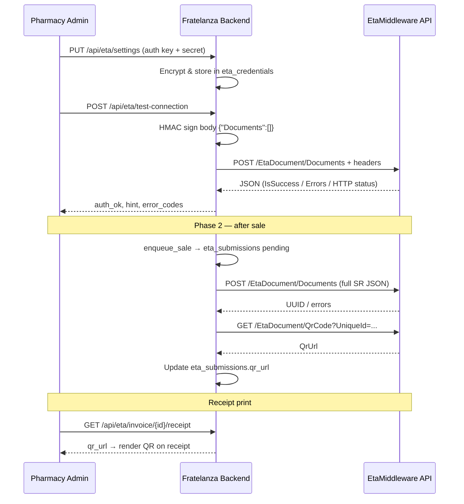

# Fratelanza Pharmacy POS — ETA Integration Cycle (For EtaMiddleware Developer)

**To:** EtaMiddleware / Integration Developer  
**From:** Fratelanza POS Engineering  
**Date:** 2026-06-30  
**Product:** Fratelanza Pharmacy POS (FastAPI + React, multi-tenant SaaS)  
**Middleware docs:** [EtaMiddleware Postman](https://documenter.getpostman.com/view/51011938/2sBXVZpF4t)  
**Production host:** `https://erp.fratelanza.com`  
**VPS outbound IP:** `187.124.15.14`

---

## 1. Summary

Fratelanza POS integrates with **your EtaMiddleware API v2** (HMAC-signed `EtaDocument` endpoints). We do **not** call the Egyptian Tax Authority directly — all e-receipt traffic goes through your middleware.

**Design rule:** POS checkout **never waits** on ETA HTTP. Submission is asynchronous (queue + background worker in Phase 2). If ETA is down, the sale still completes.

**Current status (Phase 1 — sandbox certification):**


| Capability                                  | Status                                         |
| ------------------------------------------- | ---------------------------------------------- |
| Store encrypted HMAC credentials            | ✅ Live                                         |
| Map branch → BranchCode + PosSerial         | ✅ Live                                         |
| Build `Documents[]` JSON from real invoices | ✅ Live                                         |
| Test connection (signed POST smoke test)    | ✅ Live                                         |
| Preview JSON / manual submit one invoice    | ✅ Live (admin API)                             |
| Print QR on customer receipt                | ✅ Live (polls our DB; needs successful submit) |
| Auto-submit every sale / return             | ⏳ Phase 2 (hooks stubbed, not wired)           |
| Background retry worker                     | ⏳ Phase 2                                      |


---


## 2. Actors and URLs


| Actor                  | Role                                                                           |
| ---------------------- | ------------------------------------------------------------------------------ |
| **Pharmacy cashier**   | Completes sale in POS; sees printed receipt (with ETA QR when available)       |
| **Pharmacy admin**     | Configures ETA in Settings → ETA E-Receipt                                     |
| **Fratelanza backend** | Maps invoices → JSON, signs requests, calls your API, stores submission status |
| **EtaMiddleware**      | Validates HMAC, accepts documents, returns UUID / QrUrl                        |
| **ETA sandbox host**   | `https://testserver.misrapp.com` — API at `/api`, dashboard login at same host |


**Correct API base URL (sandbox):** `https://testserver.misrapp.com/api`  
**Dashboard login:** `https://testserver.misrapp.com` (admin / Admin@eta) — same host, path must include `/api` for API calls.

---


## 3. End-to-end integration cycle


### 3.1 Setup cycle (one-time per tenant)

```
Admin opens Settings → ETA E-Receipt
        │
        ▼
GET /api/eta/settings          ← load saved config (keys masked)
GET /api/eta/readiness         ← blockers/warnings checklist
        │
        ▼
Admin enters:
  • Base URL (testserver…/api)
  • Auth key + HMAC secret (from credential.txt)
  • Walk-in customer defaults (for cash sales without registered customer)
  • BranchCode + PosSerial per pharmacy branch (e.g. B01 / P01)
        │
        ▼
PUT /api/eta/settings          ← encrypt & save credentials
PUT /api/eta/devices/{branch}  ← save branch/POS mapping
        │
        ▼
POST /api/eta/test-connection  ← our backend calls YOUR API (see §5.1)
        │
        ▼
When auth OK + readiness green → admin sets active=true (still sandbox first)
```

Credentials are stored in PostgreSQL table `eta_credentials` with **Fernet encryption** at rest. Keys are trimmed on decrypt (no accidental whitespace).

### 3.2 Certification / manual submit cycle (Phase 1 — current)

Used to certify payload shape before enabling auto-submit:

```
Admin picks a completed sale invoice
        │
        ▼
GET /api/eta/preview/{invoice_id}
        │  Returns {"Documents":[…]} — same JSON we would POST, no network call
        ▼
(Optional) Admin reviews JSON vs your Postman AcceptedDocument schema
        │
        ▼
POST /api/eta/submit-preview/{invoice_id}
        │  Our backend → POST {BaseUrl}/EtaDocument/Documents (see §5.2)
        ▼
Your middleware responds with IsSuccess, UUID, errors, etc.
        │
        ▼
(Phase 2 will persist to eta_submissions + fetch QrUrl automatically)
```


### 3.3 Sale cycle — **planned Phase 2** (not live yet)

```
Cashier completes sale (existing POS checkout — unchanged)
        │
        ▼
PostgreSQL COMMIT (invoice + stock + payment)
        │
        ▼
eta.hooks.enqueue_sale(invoice_id)   ← try/except, must not raise
        │  Checks: feature enabled + credentials active + branch device mapped
        ▼
INSERT eta_submissions (status=pending)
        │
        ▼
Background worker (cron / loop, every ~30s)
        │  Build Documents[] via mapper
        │  POST /EtaDocument/Documents
        │  On success: store eta_uuid, status=accepted
        │  GET /EtaDocument/QrCode?UniqueId=… → store qr_url
        │  On failure: status=failed, retry with backoff (eta_submission_attempts)
        ▼
Receipt UI polls GET /api/eta/invoice/{id}/receipt → shows QR when qr_url exists
```

**Important:** Phase 2 hooks exist in `backend/eta/hooks.py` but are **not yet called** from `create_sale` / returns. Today, no sale triggers an automatic POST to your API.

### 3.4 Return cycle — **planned Phase 2**

Same pattern as sales, using `DocumentType=4` (full return) or partial refund flag, with `ReferenceUUID` pointing to the original accepted receipt.

### 3.5 Customer receipt QR cycle (live UI, needs submit data)

```
Sale completes → Receipt modal opens
        │
        ▼
GET /api/eta/invoice/{invoice_id}/receipt   (poll every 4 seconds)
        │
        ├─ status=not_submitted → show "QR pending" message
        ├─ status=pending/processing → show "QR pending"
        ├─ status=accepted + qr_url → render QR code on printed receipt
        └─ status=failed → no QR (error stored for admin)
```

The frontend **does not** call your API directly. It only reads our internal endpoint, which reads `eta_submissions.qr_url`.

---


## 4. Fratelanza internal API (our backend → our frontend)

All routes require tenant JWT auth. Feature gate: `eta` must be enabled for the tenant (Control Platform).


| Method | Path                                    | Who                     | Purpose                                                   |
| ------ | --------------------------------------- | ----------------------- | --------------------------------------------------------- |
| `GET`  | `/api/eta/status`                       | Any logged-in user      | Feature on/off + operational summary                      |
| `GET`  | `/api/eta/readiness`                    | Any logged-in user      | Pre-flight blockers (credentials, devices, product codes) |
| `GET`  | `/api/eta/settings`                     | Admin                   | Load config (auth/secret shown as has_* flags only)       |
| `PUT`  | `/api/eta/settings`                     | Admin                   | Save base URL, keys, walk-in defaults, active flag        |
| `PUT`  | `/api/eta/devices/{branch_id}`          | Admin                   | Map BranchCode + PosSerial for a branch                   |
| `POST` | `/api/eta/test-connection`              | Admin                   | HMAC smoke test → calls your API (§5.1)                   |
| `GET`  | `/api/eta/preview/{invoice_id}`         | User w/ receipts option | Build JSON only, no submit                                |
| `POST` | `/api/eta/submit-preview/{invoice_id}`  | Admin                   | Submit one invoice to sandbox/production                  |
| `GET`  | `/api/eta/invoice/{invoice_id}/receipt` | User w/ receipts option | QR URL + submission status for receipt print              |


**Settings UI:** `Settings → ETA E-Receipt` (`frontend/src/components/EtaSettings.tsx`)  
**Receipt UI:** `ReceiptModal.tsx` polls `/api/eta/invoice/{id}/receipt`

---


## 5. Calls to EtaMiddleware (our backend → your API)

All outbound calls originate from **VPS IP** `187.124.15.14`.  
User-Agent: `FratelanzaPOS/2.0 (ETA integration)`.

### 5.1 Test connection — `POST /EtaDocument/Documents`

**When:** Admin clicks "Test connection" in settings.

**Request:**

```
POST {BaseUrl}/EtaDocument/Documents
Content-Type: application/json

Headers:
  EtaAuthentication: <128-char auth key from credential.txt>
  EtaTimestamp:      <Unix seconds UTC, string>
  EtaSignature:      Base64(HMAC-SHA256(payload, secretKey))
  EtaAPIVersion:     2

Body (exact string used in HMAC):
  {"Documents":[]}
```

**HMAC payload (no spaces, no separators beyond JSON):**

```
authKey + timestamp + '{"Documents":[]}'
```

Example: if `authKey=N06v…`, `timestamp=1719820800`, body=`{"Documents":[]}`:

```
payload = "N06v…" + "1719820800" + '{"Documents":[]}'
signature = Base64(HMAC-SHA256(payload, "EtaCyrus@1234"))
```

**How we judge success:**


| Response                                                        | Our interpretation                                                                     |
| --------------------------------------------------------------- | -------------------------------------------------------------------------------------- |
| HTTP 200 + JSON, no `ERR_AUTH_*` / `ERR_HMAC_*` / `ERR_IP_DENY` | Auth OK (even if `VAL_*` validation errors on empty array)                             |
| `ERR_HMAC_INV`, `ERR_AUTH_INV`                                  | Wrong key or signature                                                                 |
| `ERR_IP_DENY`                                                   | VPS IP not whitelisted                                                                 |
| HTTP 404                                                        | Wrong base URL                                                                         |
| HTTP 500                                                        | Request reached your server; we treat as **your server error** (current sandbox issue) |


**Current sandbox result from our VPS:** HTTP **500** on empty `Documents[]`, auth key length **128** (full key from credential.txt).

### 5.2 Submit sales receipt — `POST /EtaDocument/Documents`

**When:** Admin `submit-preview`, or (Phase 2) background worker after each sale.

**Request:** Same headers as §5.1.

**Body:zz**

```json
{
  "Documents": [
    { /* single SR document — see §6 */ }
  ]
}
```

**HMAC:** `authKey + timestamp + <exact raw JSON body string>`  
We serialize with `json.dumps(..., ensure_ascii=False, separators=(",", ":"))` — compact, no extra spaces.

**Expected response (per your Postman collection):**

- `IsSuccess`: boolean  
- Accepted document UUID / reference  
- `Errors` / `ErrorDetails` array with `Code` (e.g. `VAL_*`, `ERR_*`)  
- We raise on HTTP ≥400 unless `IsSuccess=true`


### 5.3 Fetch QR code — `GET /EtaDocument/QrCode`

**When:** After successful document acceptance (Phase 2 worker).

**Request:**

```
GET {BaseUrl}/EtaDocument/QrCode?UniqueId={UniqueId}
```

**Headers:**

```
  EtaAuthentication: <auth key>
  EtaTimestamp:      <Unix seconds>
  EtaSignature:      Base64(HMAC-SHA256(authKey + timestamp + "", secretKey))
  EtaAPIVersion:     2
```

Note: GET signature uses **empty string** as body (`authKey + timestamp + ""`).

**Expected:** JSON containing QrUrl (or equivalent field per your schema). We store it in `eta_submissions.qr_url` for receipt printing.

---


## 6. Document mapping (POS invoice → your `Documents[]`)

We map each **completed sale invoice** to one **Sales Receipt (SR)** document.


| Your field                           | Our source                                                                                                  |
| ------------------------------------ | ----------------------------------------------------------------------------------------------------------- |
| `InternalId`                         | `invoices.invoice_number`                                                                                   |
| `UniqueId`                           | `{BranchCode}-R-{invoice_id}-{invoice_number}`                                                              |
| `ReferenceUUID`                      | `null` for SR                                                                                               |
| `Date` / `Time`                      | `invoices.created_at` (local pharmacy time, `YYYY-MM-DD` / `HH:MM:SS`)                                      |
| `DocumentType`                       | `3` (sales receipt)                                                                                         |
| `DocumentType` return                | `4` (full return — Phase 2)                                                                                 |
| `BranchCode`                         | `eta_branch_devices.branch_code` (e.g. `B01`)                                                               |
| `PosSerial`                          | `eta_branch_devices.pos_serial` (e.g. `P01`)                                                                |
| `PaymentType`                        | `0` cash, `1` visa, `2` mixed (from payment fields)                                                         |
| `DocOrderType`                       | `0` in-store, `1` delivery                                                                                  |
| `Customer*`                          | Registered customer record, or walk-in defaults from settings; delivery name/phone override when applicable |
| `CustomerName` cash                  | Walk-in default (configurable; Arabic `نقدي` supported)                                                     |
| `DocumentDetails[]`                  | One row per `invoice_items` line                                                                            |
| `ItemCode`                           | `products.eta_item_code` → fallback `international_barcode` → `barcode`                                     |
| `EGSCode`                            | `products.eta_egs_code` (optional)                                                                          |
| `VAT` / `DocumentDetailTaxs`         | `products.vat_rate` + computed line VAT                                                                     |
| `TotalSales`, `NetAmount`, discounts | Invoice totals and line math (2 decimal places)                                                             |


**Idempotency (Phase 2):** `eta_submissions.idempotency_key` = `{tenant}-{invoice_id}-SR` so retries do not double-submit.

**Preview without submit:**

```
GET https://erp.fratelanza.com/api/eta/preview/123
Authorization: Bearer <tenant JWT>
```

Returns the exact `Documents[]` payload we would POST.

---


## 7. Database tables (our side)


| Table                                                | Purpose                                                                       |
| ---------------------------------------------------- | ----------------------------------------------------------------------------- |
| `eta_credentials`                                    | Per-environment base URL, encrypted auth/secret, walk-in JSON, `active` flag  |
| `eta_branch_devices`                                 | Maps POS `branches.id` → your `BranchCode` + `PosSerial`                      |
| `eta_submissions`                                    | One row per invoice/return submission; status, `eta_uuid`, `qr_url`, payloads |
| `eta_submission_attempts`                            | Retry audit log (HTTP status, response body)                                  |
| `products.eta_item_code`, `vat_rate`, `eta_egs_code` | Product master data for line items                                            |


We do **not** push data to your dashboard DB view directly — only via your HTTP API. (If you also expect a SQL view feed, please confirm — we received a separate "Receipt Data Integration Specification" document.)

---


## 8. Authentication flow diagram




---


## 9. Error handling (our side)


| Your error code            | Our action                                           |
| -------------------------- | ---------------------------------------------------- |
| `VAL_*`                    | Show to admin; fix product code, branch, date, etc.  |
| `ERR_AUTH_*`, `ERR_HMAC_*` | Settings error; re-save credentials                  |
| `ERR_IP_DENY`              | Ask you to whitelist `187.124.15.14`                 |
| `ERR_DUP_*`                | Treat as success if UUID returned (idempotent retry) |
| HTTP 5xx                   | Retry with backoff (Phase 2); never block POS sale   |


---


## 10. Sandbox credentials we use


| Item        | Value                                                              |
| ----------- | ------------------------------------------------------------------ |
| Auth key    | 128 chars, starts `N06vshhuLd3HpRVy…` (full key in credential.txt) |
| HMAC secret | `EtaCyrus@1234`                                                    |
| BranchCode  | `B01`                                                              |
| PosSerial   | `P01`                                                              |
| API base    | `https://testserver.misrapp.com/api`                                  |
| Dashboard   | `https://testserver.misrapp.com` (admin / Admin@eta)               |


---


## 11. Questions for you

1. Is `POST {"Documents":[]}` a valid auth smoke test? We currently get **HTTP 500** from VPS `187.124.15.14`.
2. What is the **expected** HTTP status + JSON for that empty-body test?
3. Is our HMAC algorithm correct: `authKey + timestamp + rawJsonBody`, SHA-256, Base64?
4. For GET QrCode, is the signed payload `authKey + timestamp + ""` (empty body)?
5. After `POST /Documents` success, do you return QrUrl in the response, or must we always call `GET /QrCode`?
6. Any IP whitelist needed beyond confirming `187.124.15.14`?
7. Do you also require a SQL view / flat export, or is HTTP API sufficient?

---


## 12. Code references (Fratelanza repo)


| File                                       | Role                                  |
| ------------------------------------------ | ------------------------------------- |
| `backend/eta/signing.py`                   | HMAC-SHA256 v2 header builder         |
| `backend/eta/client.py`                    | HTTP client: test, submit, QrCode     |
| `backend/eta/mapper.py`                    | Invoice → Documents[]                 |
| `backend/eta/router.py`                    | Internal REST API                     |
| `backend/eta/hooks.py`                     | Phase 2 post-commit enqueue (stub)    |
| `backend/eta/db.py`                        | Credentials + submissions persistence |
| `frontend/src/components/EtaSettings.tsx`  | Admin settings UI                     |
| `frontend/src/components/ReceiptModal.tsx` | QR polling on receipt                 |


---

*Fratelanza POS — ETA integration Phase 1 complete, awaiting successful sandbox auth test before Phase 2 auto-submit.*